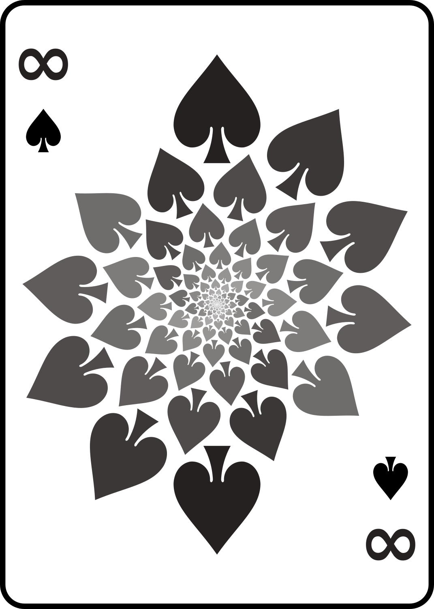
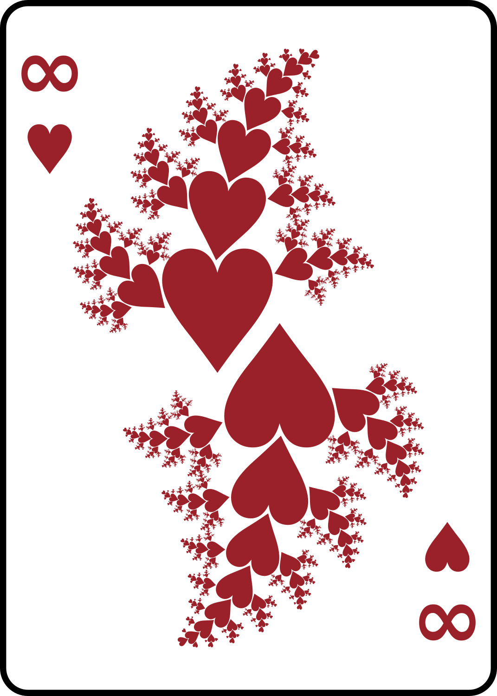
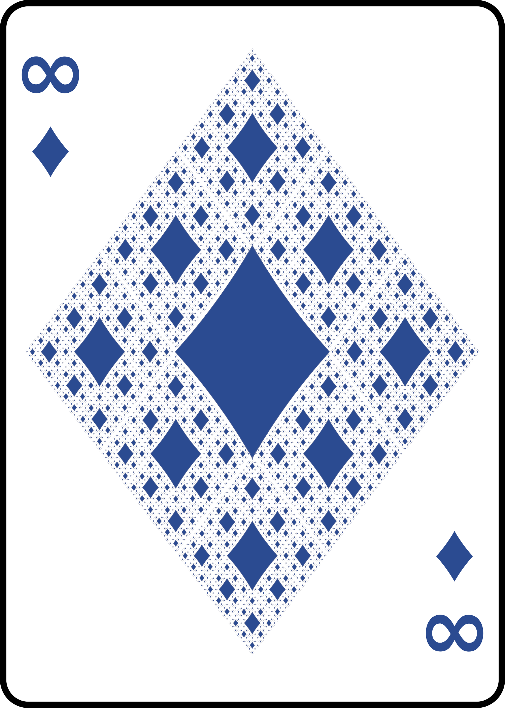
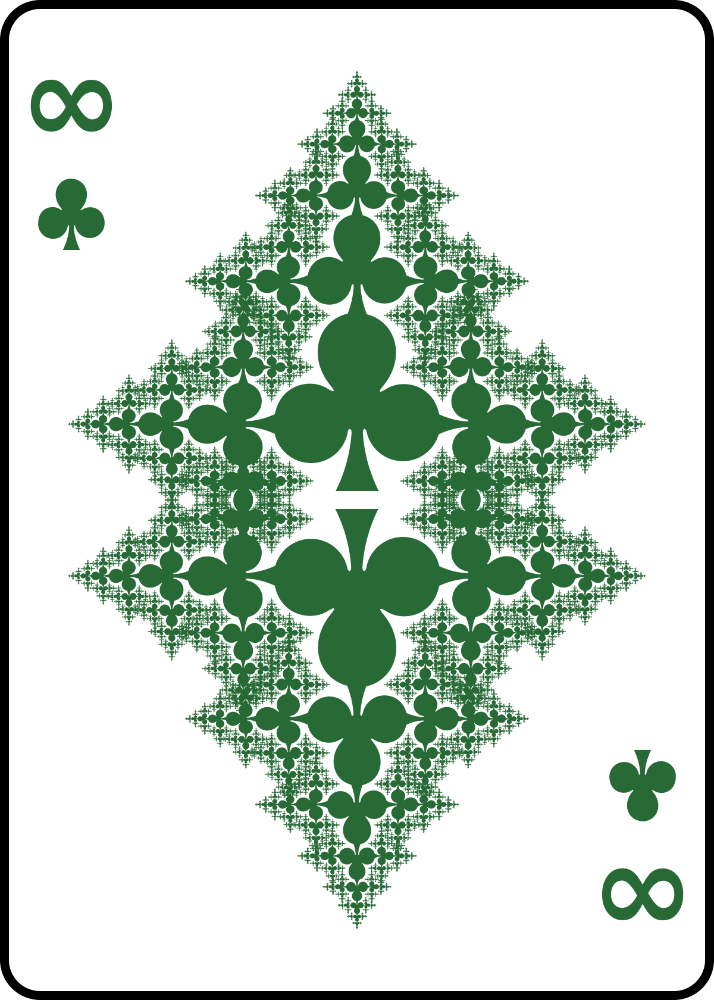
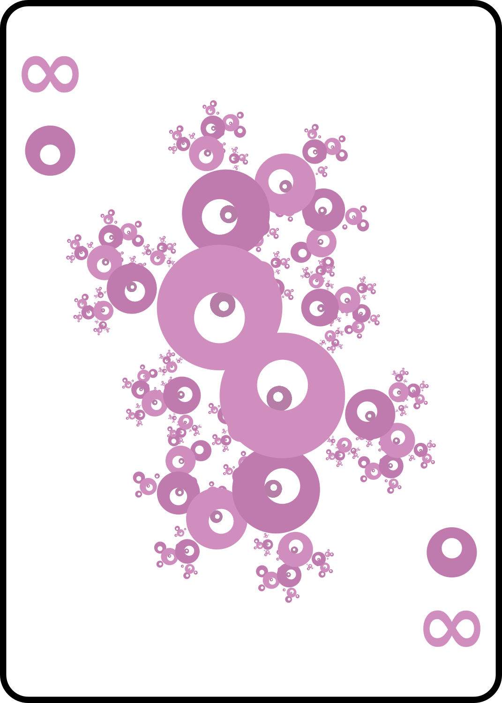
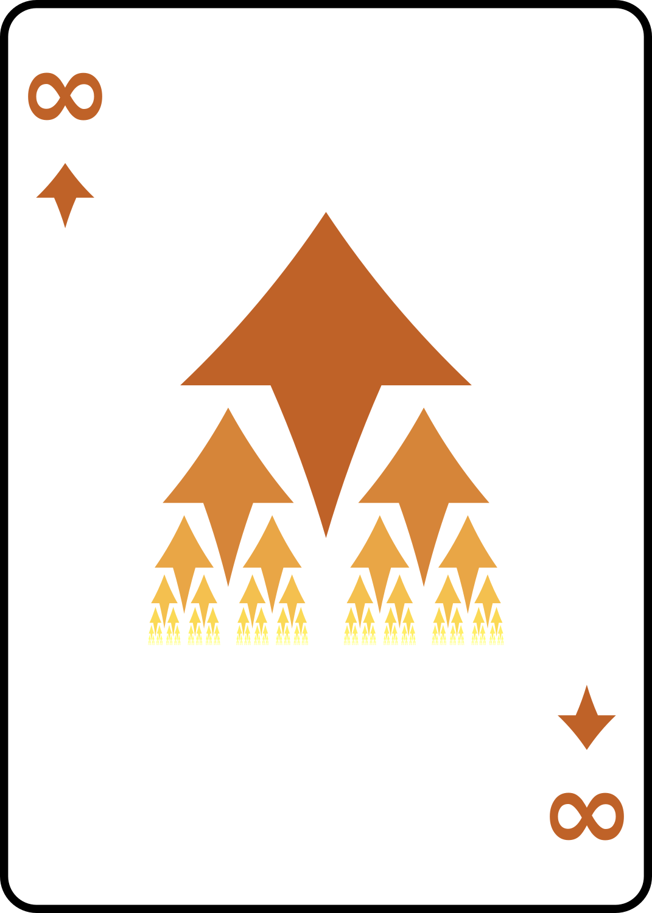
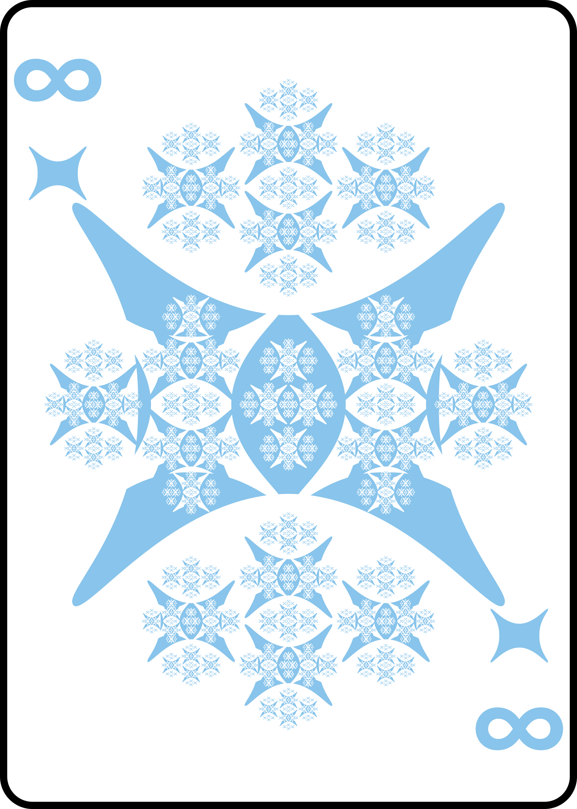
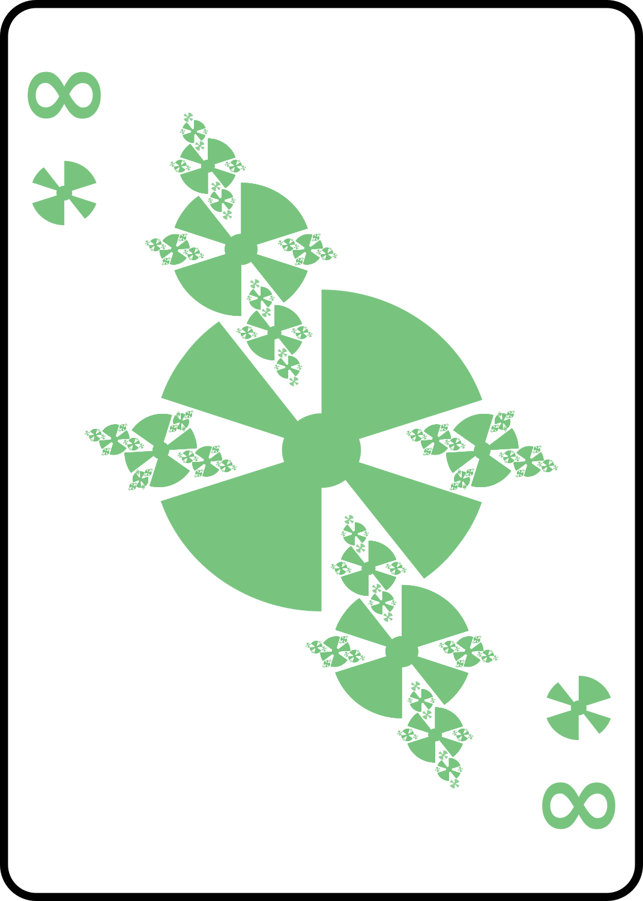
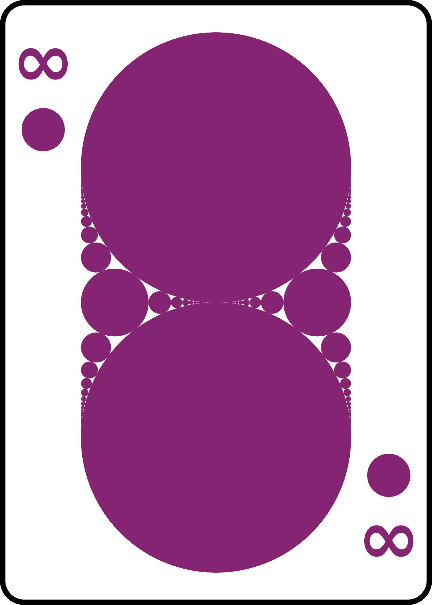
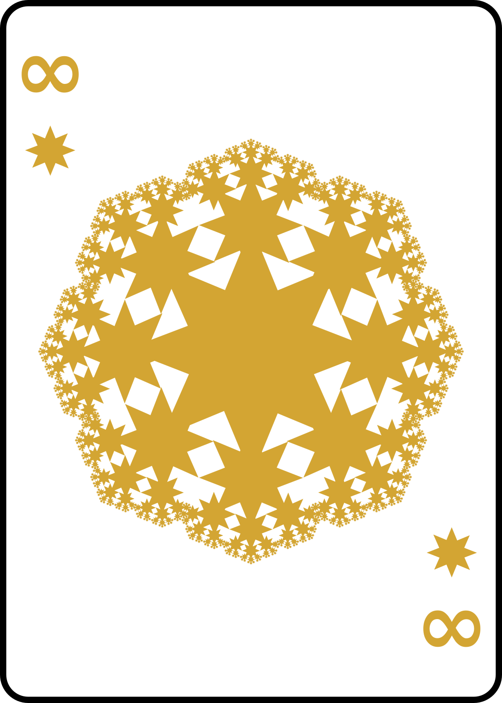

# Infinity of Spades - svg fractal playing cards.

In this repo, you can find some examples of fractals rendered using svg groups.

The fractals on these cards are generated primarily using [iterated function systems](https://en.wikipedia.org/wiki/Iterated_function_system).

The idea is simple:
Figure out a set of transformations to apply to copies of the base image (a card pip), 
then apply those same transformations to the entire set of copies, 
and iterate as desired.

This method of rendering fractals is simple in execution but is very resource innefficient. 
It may take very large amounts of memory, and quite some time to fully render these fractals at higher iteration depths.
But the advantage is that you don't need any special software other than a text editor and a web browser.

## Preview of the Cards

   

   

  

## Credit

The images in this repo use the public domain suit icons from the [Singularity Deck, by Matthew Ross](https://www.singularity.games/p/deck.html).

Thanks to [Stefan Goessner](https://goessner.net/articles/svg/fractals/) for the idea.
